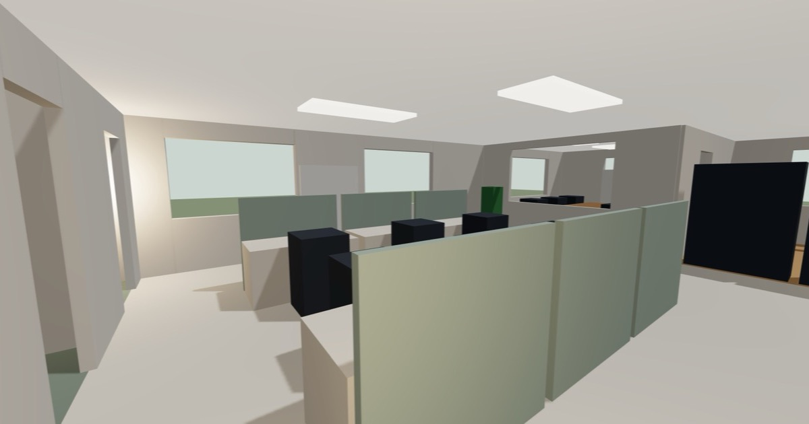
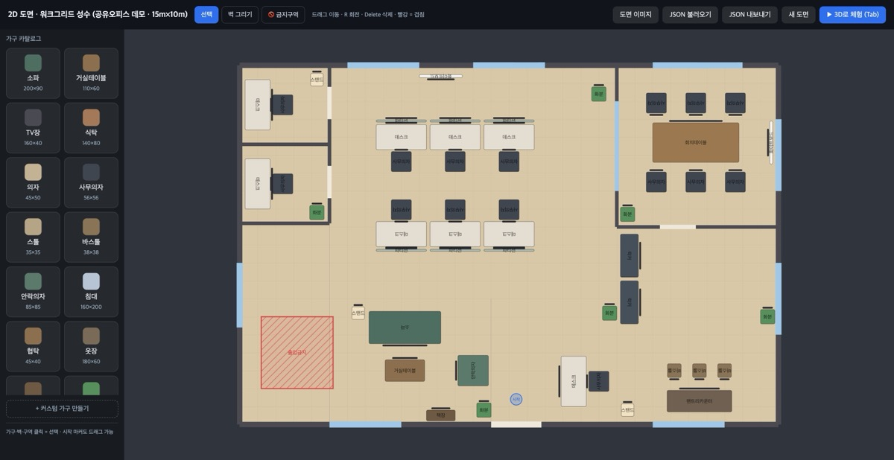

# floorplan-viewer — 3D 오피스 투어 빌더

**어드민이 2D 도면을 그리면, 고객이 3D로 걸어본다.**

공유오피스 홈페이지를 만들면서 지점 소개가 사진 몇 장과 평면도 한 장으로 끝나는 게 아쉬웠습니다.
그래서 운영자가 도면을 그리면 그대로 고객용 1인칭 3D 투어가 되는 빌더를 만들었습니다.
지금 보이는 공유오피스 데모 씬도 이 에디터로 직접 그려서 내보낸 것입니다.

| | |
|---|---|
| 🚶 고객 모드 (3D 투어) | https://floorplan-viewer-sooty.vercel.app/?viewer=1 |
| 🛠️ 어드민 모드 (2D 에디터) | https://floorplan-viewer-sooty.vercel.app/?mode=admin |
| 🏠 소개 페이지 | https://floorplan-viewer-sooty.vercel.app/ |




## 아키텍처

```
┌────────────────┐     내보내기/저장      ┌────────────────┐
│  2D 도면 에디터  │ ──────────────────▶ │   씬 JSON       │
│  (SVG + React)  │ ◀────────────────── │  (SCHEMA.md가    │
└────────────────┘      불러오기         │   유일한 계약)    │
                                        └───────┬────────┘
                                                │ 같은 데이터
                                                ▼
                                        ┌────────────────┐
                                        │  3D 1인칭 뷰어   │
                                        │ (React Three    │
                                        │     Fiber)      │
                                        └────────────────┘
```

- 에디터와 뷰어는 서로를 모릅니다. 벽·문·창·가구·금지구역·조명이 전부 [씬 JSON 스키마](SCHEMA.md)로만 오갑니다.
- 가구 인스턴스는 `catalogId + position + rotationY`만 저장합니다. 크기·색·상호작용(앉기, 조명 토글)은 카탈로그가 소유하므로, 씬 데이터를 건드리지 않고 기능을 확장할 수 있습니다.
- 의존성은 react, react-dom, three, @react-three/fiber, @react-three/drei — 5개가 전부입니다.

## 설계 의사결정

**cm → m 좌표 변환은 단 한 곳.** 2D 도면(cm, +z 아래)과 3D 월드(m, y-up)의 규칙을 코드보다 먼저 [SCHEMA.md](SCHEMA.md)로 확정하고, 변환 함수를 `src/lib/units.js` 한 지점에 강제했습니다. 2D↔3D 미러링(거울상) 버그를 원천 차단하기 위한 결정입니다. 가구 바닥의 정면 마커가 회전 규약의 육안 검증 장치입니다.

**물리엔진 없는 자체 충돌.** 평면 이동이 전부인 요구사항에 물리엔진은 과합니다. 원(플레이어) vs 선분(벽)·회전 바운딩박스(가구)의 2D 충돌을 `src/lib/collision.js`에 직접 구현했습니다 — 문 개구부 구간만 통과를 허용하고, 창은 차단합니다. 번들 수백 KB를 아끼고 거동을 완전히 제어합니다.

**캔버스 라이브러리 없는 SVG 에디터.** `src/editor/Editor2D.jsx`는 순수 SVG + 포인터 이벤트입니다. 도면 좌표(cm)와 SVG viewBox를 1:1로 맞춰 변환 계층 자체를 없앴습니다. 드래그·회전·스냅·겹침 경고·벽 그리기·금지구역·도면 밑그림까지 외부 의존성 없이 동작합니다.

**60fps 루프와 React 렌더의 분리.** 매 프레임 갱신되는 데이터(플레이어 위치·시선)는 mutable 스토어(`lib/pose.js`)로 rAF 루프에서만 다루고, UI에 보여야 하는 상태(HUD 프롬프트)는 `useSyncExternalStore`(`lib/hud.js`)로 변경 시에만 리렌더합니다.

**터치 기기는 다른 답.** 포인터락이 불가능한 터치 기기에선 1인칭을 흉내 내는 대신, 천장을 벗긴 돌하우스 뷰 + 궤도 컨트롤로 폴백합니다. 같은 씬 데이터에서 갈라지는 두 번째 표현입니다.

## 기능

- **어드민(2D)**: 벽 클릭-클릭 그리기(문·창 개구부는 JSON), 카탈로그 가구 드래그·R 회전·Delete, 커스텀 가구 제작(크기·색·앉기), **출입금지 구역(클릭 = 벽으로 닫힌 영역 자동 감지 → 다각형 · 드래그 = 사각형 · 꼭짓점 드래그/추가/삭제)**, 도면 이미지 밑그림(실측 폭 보정), 시작 지점 마커, JSON 내보내기/불러오기, Tab으로 3D 즉시 전환
- **고객(3D)**: WASD + 마우스 1인칭, Shift 달리기, E로 의자·소파·바스툴 앉기(시점 하강)와 스탠드 조명 토글, 벽·가구·금지구역 충돌, 문으로만 통행, 우상단 미니맵(위치·시선), 씬별 천장 조명 패널. **금지구역은 고객에겐 그냥 벽 덩어리로 보이고**(3D·미니맵 동일), 내부 가구는 상호작용·조명이 꺼진다
- **층(levels)**: 한 건물에 여러 층, 에디터 층 탭에서 추가·삭제·전환. **층 단위 "고객 비공개"(🔒)** — 비공개 층은 고객 투어의 층 전환 UI에서 아예 빠지고, 공개 층이 1개면 전환 UI 자체가 사라져 존재를 알 수 없다(어드민 미리보기에선 접근 가능). v0 단층 JSON도 자동 정규화로 그대로 로드
- **고객 체험 미리보기**: 에디터의 "👁 고객 체험" 버튼 — 저장·내보내기 없이, 비공개 층을 숨긴 실제 고객 화면 그대로를 그 자리에서 시뮬레이션 ("▶ 3D로 체험"은 전 층을 보는 어드민 미리보기)
- **씬 전환**: `?scene=demo`(아파트) 등 JSON 파일만 바꾸면 다른 공간 — 공간은 코드가 아니라 데이터

## 실행

```bash
npm install
npm run dev        # http://localhost:5173
```

| URL | 화면 |
|---|---|
| `/` | 소개 랜딩 |
| `/?mode=admin` | 2D 도면 에디터 (기본 씬: 공유오피스) |
| `/?viewer=1` | 고객용 3D 투어 (편집 접근 불가) |
| `/?scene=demo&mode=admin` | 다른 씬 로드 |

## 검증

배포 전 자동 시험(브라우저 스크립트로 플레이어를 실제로 걷게 함): 문 통과 / 벽·창 차단 / 금지구역 차단 / 정문 밖 출입 / E 앉기·일어나기(시선 높이 변화) / 조명 토글 프롬프트. 수동 체크: 정면 마커와 SCHEMA.md 회전표 일치, 코너 떨림 없음, "걸어다니는 게 재밌다".

개발 메모: 브라우저 탭이 백그라운드면 rAF가 멈춰 캔버스가 그려지지 않습니다(버그 아님). 자동 검증은 별도 창에서. `window.__camera`는 dev 빌드 전용입니다.

## 로드맵

- **접근성**: 키보드 전용 시선, HUD의 스크린리더 노출(aria-live), 씬 데이터에서 자동 생성하는 텍스트 대체 투어 + 방별 텔레포트, prefers-reduced-motion
- **GLB 가구**: 카탈로그에 `glb` 필드 추가(원점=바닥 중심, 정면=-z 규약이라 콜라이더·에디터·미니맵 무수정), Suspense 폴백은 지금의 컬러 박스
- **모바일 걷기**: 가상 조이스틱 + 드래그 시선
- 문·창 편집 UI(현재는 JSON에서만), 에디터 undo/redo

## 알려진 제한

- 문·창은 에디터 UI가 아직 없어 JSON에서만 편집됩니다
- 모바일은 둘러보기 폴백만 제공합니다 (1인칭 걷기는 데스크톱)
